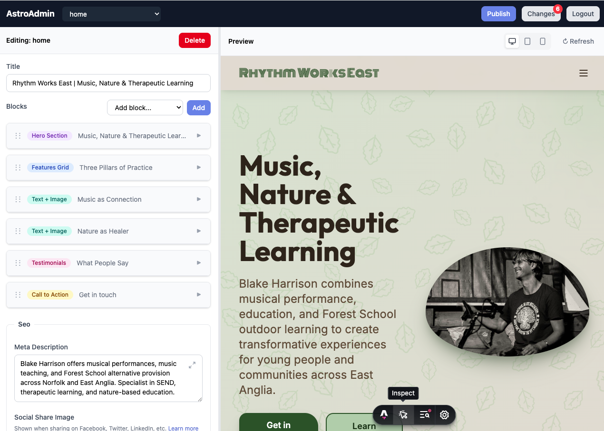

# AstroAdmin

Admin interface for [Astro Content Collections](https://docs.astro.build/en/guides/content-collections/). Auto-generates forms from your Zod schemas.



## Features

- **Schema-driven forms** - Auto-generates fields from `src/content.config.ts`
- **Database content store** - Content lives in SQLite; the site reads it at build time via a content-layer loader
- **Block editor** - Visual editing for discriminated unions (page builders)
- **Live preview** - See changes in real-time via iframe
- **Image uploads** - Upload and manage images with alt text
- **Optional git + deploy adapters** - Publish straight to a host (rsync), with git as an optional pre-step
- **Collection management** - Create and delete entries

## Requirements

Before using AstroAdmin, ensure your project has:

- **Bun** - AstroAdmin runs on Bun; the loader uses `bun:sqlite` (with a
  `better-sqlite3` fallback for sites that build under Node — see below)
- **Astro 6.0+** with `astro.config.mjs` or `astro.config.ts`
- **Content Collections** schemas in `src/content.config.ts`

Content is stored in a SQLite database (`.astroadmin/content.db`), not in
`src/content` files. Your site reads it at build time via the AstroAdmin
content-layer loader (see [below](#database-content-store--loader-astro-6)).

```
your-astro-site/
├── astro.config.mjs        ← Required
├── src/
│   └── content.config.ts   ← Required (collection schemas)
└── .astroadmin/
    └── content.db          ← Content store (created automatically)
```

**Don't have Content Collections?** See the [setup guide](./docs/content-collections.md).

## Usage

```bash
# Start admin server (from your Astro project root)
npx astroadmin dev

# With options
npx astroadmin dev --port 3030 --project ./my-astro-site

# If you manage Astro dev server separately
npx astroadmin dev --no-astro
```

This automatically starts both AstroAdmin and the Astro dev server. The URLs will be printed when ready. Default credentials: `admin` / `admin`

## Documentation

- [Getting Started](./docs/getting-started.md) - Full setup guide
- [Requirements](./docs/requirements.md) - Detailed requirements
- [Content Collections](./docs/content-collections.md) - Schema setup guide
- [Configuration](./docs/configuration.md) - Customization options

## Astro Integration (optional)

For collections that aren't pages (e.g., testimonials, team members), AstroAdmin can preview them rendered inside their block components. Add the integration to your Astro config:

```javascript
// astro.config.mjs
import { defineConfig } from 'astro/config';
import astroadmin from 'astroadmin/integration';

export default defineConfig({
  integrations: [astroadmin()],
});
```

This injects a `/component-preview/` route during development that renders your block components with the item being edited. Without this integration, non-page collections will show a 404 in the preview iframe.

**Requirements:**
- Block components in `src/components/blocks/` following the naming convention `{BlockType}Block.astro` (e.g., `TestimonialsBlock.astro`)
- Fields referencing collections should use the naming convention `{collection}Ids` (e.g., `testimonialIds`)

## Database content store & loader (Astro 6)

AstroAdmin stores content in SQLite and your site reads it at build time through
a content-layer loader. In `src/content.config.ts`:

```ts
import { defineCollection, z } from 'astro:content';
import { astroadminLoader } from 'astroadmin/loader';

const pages = defineCollection({
  loader: astroadminLoader({ collection: 'pages' }),
  schema: z.object({ title: z.string() }),
});

// Data collections (no markdown body) pass type: 'data':
const team = defineCollection({
  loader: astroadminLoader({ collection: 'team', type: 'data' }),
  schema: z.object({ name: z.string() }),
});

export const collections = { pages, team };
```

You keep defining the Zod schema; the loader ships none and relies on Astro's
`parseData`, so the same schema drives both AstroAdmin's forms and your site's
read-time validation.

**Build under Bun.** The loader reads the content store with Bun's built-in
`bun:sqlite`, so the simplest path is to build under Bun: AstroAdmin runs the dev
server under Bun automatically, and production builds use `bunx --bun astro build`.
This is true on hosted CI too — Netlify, GitHub Actions, etc. all support Bun as
the build runtime, so point your build command at `bunx --bun astro build`.

If a site must build under **Node** (no Bun available), the loader transparently
falls back to [`better-sqlite3`](https://github.com/WiseLibs/better-sqlite3) —
install it in the site (`npm install better-sqlite3`) and a plain `astro build`
will read the store. This is an opt-in escape hatch (a native addon, so its
prebuilt binary must match the host's Node version); building under Bun needs no
extra dependency.

### Publishing without git

Content lives in the database, so git is optional. Set `GIT_ENABLED=false` (or
`git: { enabled: false }` in `astroadmin.config.js`) and publishing becomes
build + deploy via the configured [deploy adapter](./docs/deploy-adapters.md),
with no commits. With git enabled, publishing also commits your asset paths
(`config.git.paths`) — never `src/content`, and never the binary DB unless
`git.includeDb` is true.

## Configuration (optional)

Create `astroadmin.config.js` in your project root:

```javascript
export default {
  preview: {
    url: 'http://localhost:4321', // Astro dev server
  },
  auth: {
    username: process.env.ADMIN_USER || 'admin',
    password: process.env.ADMIN_PASSWORD || 'admin',
  },
};
```

## Troubleshooting

### "Invalid Astro project" error

This means AstroAdmin couldn't find the required files:

1. **Run from project root** - Where `astro.config.mjs` is located
2. **Set up Content Collections** - Create `src/content.config.ts`

```bash
# Quick fix
touch src/content.config.ts
```

See [Requirements](./docs/requirements.md) for details.

### Preview not loading

1. AstroAdmin should auto-start Astro - check for `[astro]` prefixed output
2. If using `--no-astro`, ensure your Astro dev server is running on port 4321
3. Check the preview URL in your config matches the Astro server

## How it works

1. Parses your `src/content.config.ts` using esbuild
2. Converts Zod schemas to JSON Schema via `zod-to-json-schema`
3. Auto-generates form fields from the schema
4. Detects discriminated unions for block-based editing
5. Saves changes to a SQLite content store (`.astroadmin/content.db`)
6. Your site reads that store at build time via `astroadmin/loader`

## License

MIT
